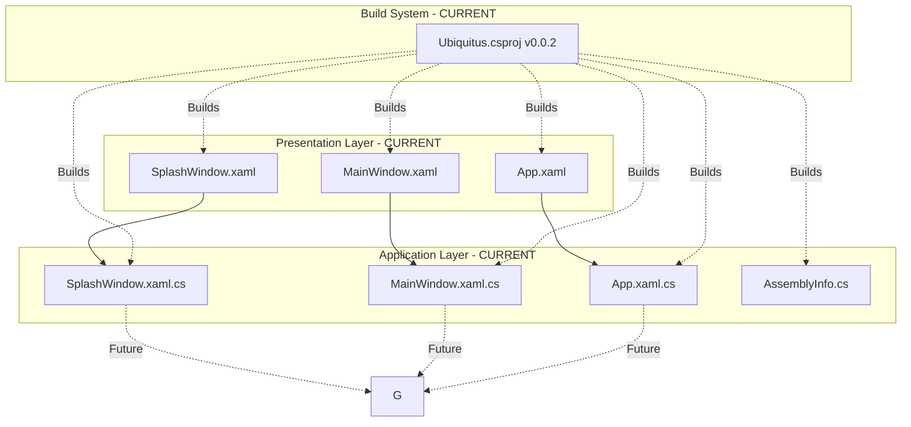
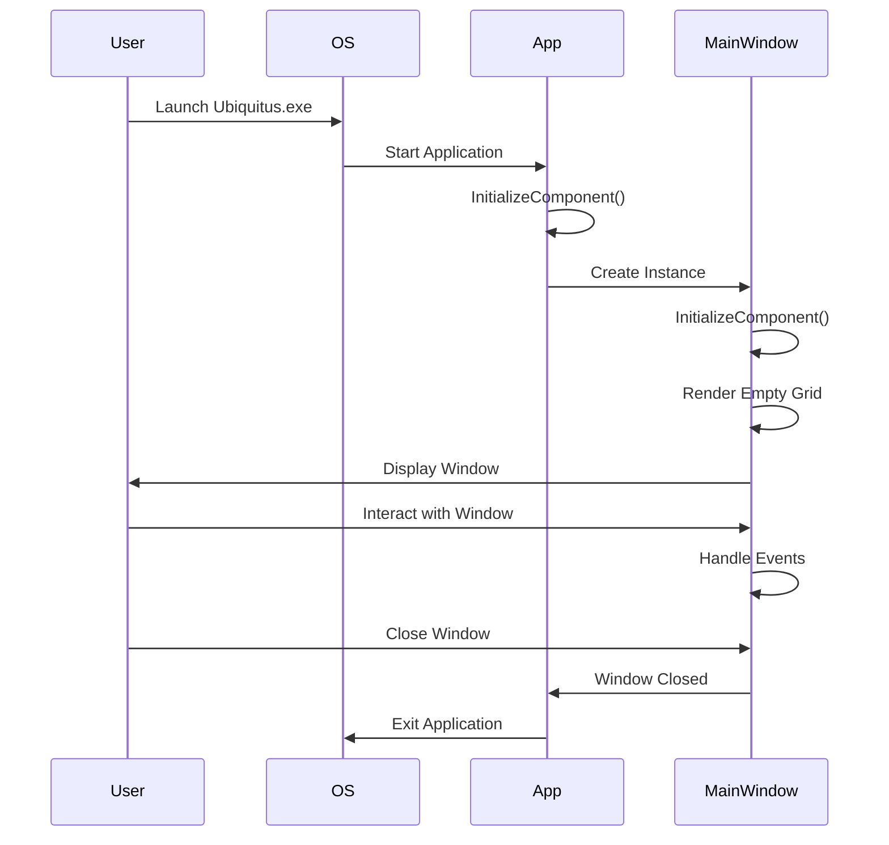
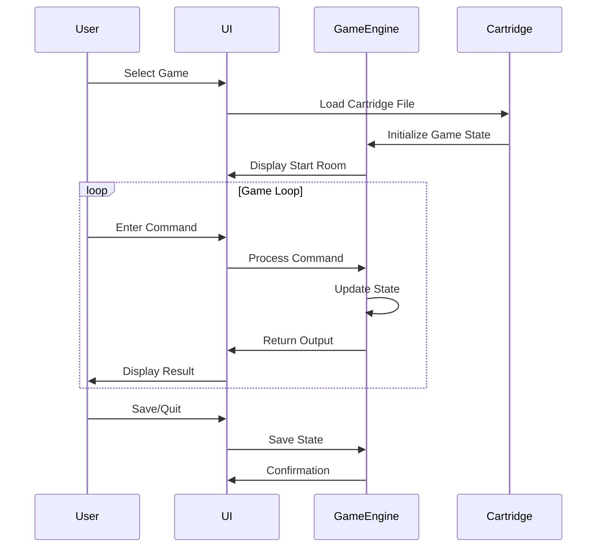
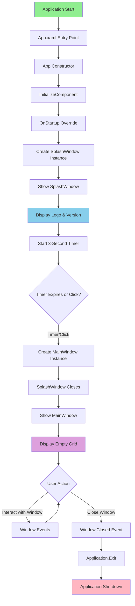
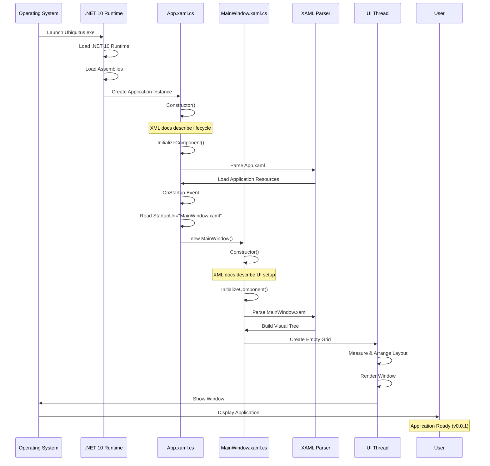
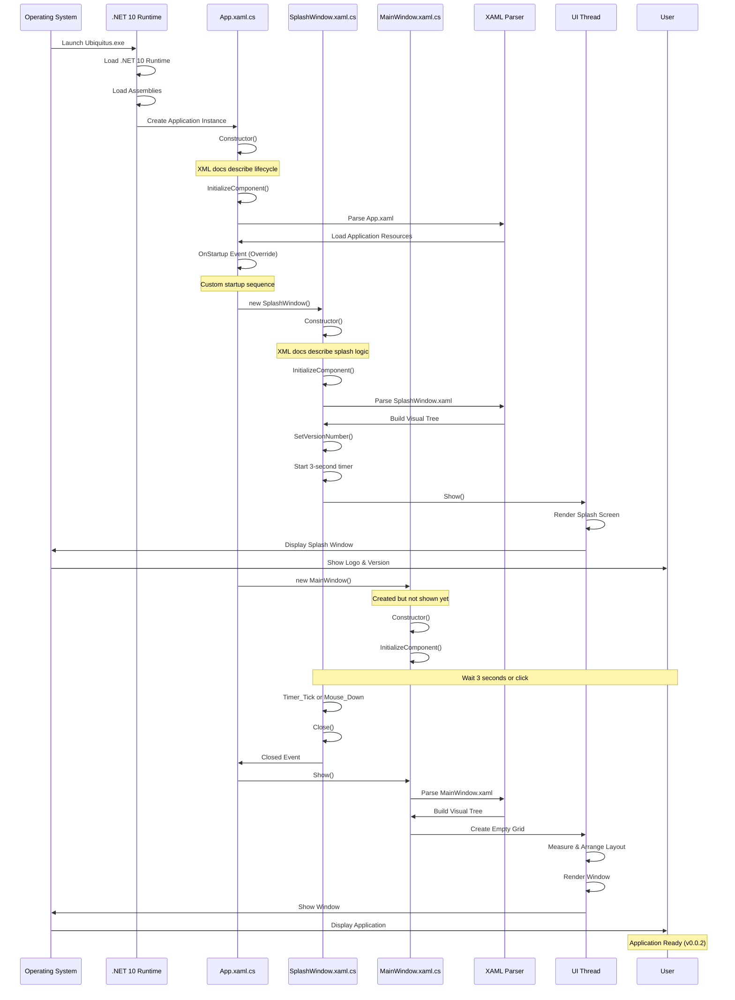
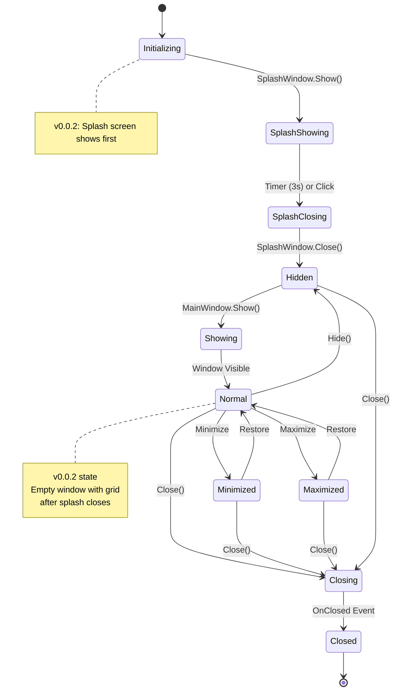

# Ubiquitus Architecture

**Project**: Ubiquitus Game Engine  
**Version**: 0.0.2  
**Framework**: .NET 10.0-windows / WPF  
**Last Updated**: December 19, 2025

---

## Table of Contents

1. [Overview](#overview)
2. [Project Structure](#project-structure)
3. [Architecture Principles](#architecture-principles)
4. [System Architecture](#system-architecture)
5. [Application Structure](#application-structure)
6. [Design Patterns](#design-patterns)
7. [Technology Stack](#technology-stack)
8. [Data Flow](#data-flow)
9. [Application Flow](#application-flow)
10. [Future Architecture](#future-architecture)

---

## Overview

Ubiquitus is a Windows Presentation Foundation (WPF) application designed as a foundation for running text-based adventure games through a cartridge system. The current version (0.0.1) establishes the core application framework with a focus on clean architecture and extensibility.

### Design Goals

1. **Modern Desktop Experience**: Leverage WPF for rich UI capabilities
2. **Game Engine Agnostic**: Support multiple game types via cartridges (future)
3. **Developer-Friendly**: Easy to understand and extend
4. **User-Focused**: Intuitive interface for players (in development)
5. **Well-Documented**: Comprehensive XML documentation for all code

### Current State

**Version**: 0.0.2  
**Status**: Initial Development  
**Platform**: .NET 10.0-windows / WPF

The project is currently in early development. The foundation includes:
- ? WPF application framework
- ? Splash screen with logo and version display
- ? Custom application startup sequence
- ? Project structure and organization
- ? Documentation system
- ? XML code documentation
- ? Game engine integration (planned)
- ? Cartridge system (planned)
- ? Save/load functionality (planned)

---

## Project Structure

```
ubiquitous/
?
??? src/                          # Source code
?   ??? App.xaml                  # Application definition
?   ??? App.xaml.cs               # Application logic with custom startup
?   ??? SplashWindow.xaml         # Splash screen UI
?   ??? SplashWindow.xaml.cs      # Splash screen logic
?   ??? MainWindow.xaml           # Main window UI
?   ??? MainWindow.xaml.cs        # Main window logic
?   ??? AssemblyInfo.cs           # Assembly configuration
?   ??? Ubiquitus.csproj          # Project file
?   ?
?   ??? AppData/                  # Application data
?   ?   ??? Documentation/        # Project documentation
?   ?   ?   ??? Generated/        # Auto-generated docs
?   ?   ??? Image/Logo/           # Logo and branding assets
?   ?   ??? PromptLog/            # Development logs
?   ?   ??? CHANGELOG.md          # Version history
?   ?   ??? ROADMAP.md            # Future plans
?   ?   ??? ARCHITECTURE.md       # Architecture documentation
?   ?
?   ??? Cartridge/                # Game cartridge files (future)
?   ??? GameLibrary/              # Game libraries (future)
?
??? .github/development/          # Development notes
??? LICENSE                       # License file
??? README.md                     # Project overview
```

### File Organization

| Directory/File | Purpose |
|---------------|---------|
| **src/** | Main source code directory |
| **src/App.xaml** | Application-level resources and configuration |
| **src/App.xaml.cs** | Application lifecycle with custom startup |
| **src/SplashWindow.xaml** | Splash screen UI definition |
| **src/SplashWindow.xaml.cs** | Splash screen code-behind and event handlers |
| **src/MainWindow.xaml** | Main window UI definition |
| **src/MainWindow.xaml.cs** | Main window code-behind and event handlers |
| **src/AssemblyInfo.cs** | Assembly-level attributes and WPF theme settings |
| **src/Ubiquitus.csproj** | Project configuration and build settings |
| **src/AppData/** | Non-compiled application data and documentation |
| **src/AppData/Documentation/** | Technical documentation |
| **src/AppData/Image/** | Image assets and logos |
| **src/AppData/PromptLog/** | Development session logs |
| **src/Cartridge/** | Game cartridge files (future feature) |
| **src/GameLibrary/** | External game engine libraries (future feature) |

---

## Architecture Principles

### SOLID Principles

The architecture follows SOLID principles where applicable:

- **Single Responsibility**: Each class has one clear purpose
  - `App.xaml.cs`: Application lifecycle management
  - `MainWindow.xaml.cs`: Main window UI logic
  - `AssemblyInfo.cs`: Assembly-level configuration
  
- **Open/Closed**: Designed for extension without modification
  - Placeholder folders for future components (GameLibrary/, Cartridge/)
  - Modular structure allows adding features without changing core

- **Liskov Substitution**: Will be applicable with game engine interfaces (future)

- **Interface Segregation**: Planned for game engine integration (future)

- **Dependency Inversion**: Will be implemented with DI container (future)

### Clean Architecture Layers

```
???????????????????????????????????????????
?     Presentation Layer (WPF)            ?
?  - MainWindow.xaml (UI Definition)      ?
?  - App.xaml (Application Resources)     ?
?  - SplashWindow.xaml (Splash Screen UI) ?
?  - SplashWindow.xaml.cs (Splash Logic)?
???????????????????????????????????????????
              ?
???????????????????????????????????????????
?     Application Layer                   ?
?  - MainWindow.xaml.cs (UI Logic)        ?
?  - App.xaml.cs (Lifecycle Management)   ?
???????????????????????????????????????????
              ?
???????????????????????????????????????????
?     Future: Domain Layer                ?
?  - Game Engine                          ?
?  - Cartridge System                     ?
?  - Business Logic                       ?
???????????????????????????????????????????
              ?
???????????????????????????????????????????
?     Future: Infrastructure Layer        ?
?  - File System Access                   ?
?  - Data Persistence                     ?
?  - External Integrations                ?
???????????????????????????????????????????
```

---

## System Architecture

### High-Level Architecture (Current)

```
????????????????????????????????????????????????
?              Ubiquitus.exe                   ?
?                                              ?
?  ?????????????????????????????????????????? ?
?  ?     WPF Application (App.xaml)         ? ?
?  ?                                        ? ?
?  ?  ???????????????????????????????????? ? ?
?  ?  ?  Startup Sequence                ? ? ?
?  ?  ?                                  ? ? ?
?  ?  ?  1. SplashWindow (3 seconds)     ? ? ?
?  ?  ?     - Shows logo                 ? ? ?
?  ?  ?     - Displays version           ? ? ?
?  ?  ?                                  ? ? ?
?  ?  ?  2. MainWindow                   ? ? ?
?  ?  ?     - Empty Grid (Placeholder)   ? ? ?
?  ?  ?     - Ready for content          ? ? ?
?  ?  ???????????????????????????????????? ? ?
?  ?????????????????????????????????????????? ?
?                                              ?
?  ?????????????????????????????????????????? ?
?  ?     AssemblyInfo.cs                    ? ?
?  ?  - WPF Theme Configuration             ? ?
?  ?????????????????????????????????????????? ?
????????????????????????????????????????????????
```

### Architectural Layers

Ubiquitus follows clean architecture principles with clear separation of concerns:

#### Layers

```
?????????????????????????????????
?     Presentation Layer (WPF)        ?
?  - MainWindow.xaml                  ?
?  - App.xaml                         ?
?  - SplashWindow.xaml                ?
?????????????????????????????????
           ?
?????????????????????????????????
?     Application Layer               ?
?  - Event Handlers                   ?
?  - UI Logic                         ?
?????????????????????????????????
           ?
?????????????????????????????????
?     Business Logic (Future)         ?
?  - Game Engine                      ?
?  - Command Processing               ?
?????????????????????????????????
           ?
?????????????????????????????????
?     Data Access (Future)            ?
?  - Cartridge Loading                ?
?  - Save Management                  ?
?????????????????????????????????
```

#### Design Patterns

- **MVVM**: Planned for future implementation
- **Partial Classes**: WPF code-behind pattern
- **Repository Pattern**: Planned for cartridge management
- **Dependency Injection**: Planned for loose coupling

### Component Diagram


---

## Application Structure

### Project Organization

```
Ubiquitus/
?
??? App.xaml                    # Application definition
??? App.xaml.cs                 # Application code-behind
??? SplashWindow.xaml           # Splash screen UI definition
??? SplashWindow.xaml.cs        # Splash screen logic
??? MainWindow.xaml             # Main window UI definition
??? MainWindow.xaml.cs          # Main window logic
??? AssemblyInfo.cs             # Assembly-level configuration
??? Ubiquitus.csproj            # Project file with version info
?
??? AppData/                    # Application data (not in project)
?   ??? Documentation/          # Project documentation
?   ?   ??? Generated/          # Auto-generated docs (future)
?   ??? Image/                  # Image assets (future)
?   ??? PromptLog/              # Development logs
?   ??? CHANGELOG.md            # Version history
?   ??? ROADMAP.md              # Future plans
?   ??? ARCHITECTURE.md         # This document
?   ??? ARCHITECTURE_APPLICATION_FLOW.md  # Flow diagrams
?
??? Cartridge/                  # Placeholder for game cartridges (future)
??? GameLibrary/                # Placeholder for game libraries (future)
```

### File Responsibilities

| File | Purpose | Layer | Documentation |
|------|---------|-------|---------------|
| `App.xaml` | Application-level XAML resources | Presentation | ? |
| `App.xaml.cs` | Application lifecycle with custom startup | Application | ? Complete XML docs |
| `MainWindow.xaml` | Main UI structure | Presentation | ? |
| `MainWindow.xaml.cs` | Window logic and event handling | Application | ? Complete XML docs |
| `SplashWindow.xaml` | Splash screen UI structure | Presentation | ? |
| `SplashWindow.xaml.cs` | Splash screen logic with timer | Application | ? Complete XML docs |
| `AssemblyInfo.cs` | WPF theme and assembly config | Infrastructure | ? Complete XML docs |
| `Ubiquitus.csproj` | Project configuration and build | Build System | ? Version 0.0.2 |

---

## Design Patterns

### 1. Model-View-ViewModel (MVVM)

**Status**: Planned for future implementation

**Current State**: Basic code-behind pattern
- Views: XAML files (MainWindow.xaml, App.Xaml)
- Code-behind: Event handlers and minimal logic

**Future State**: Full MVVM with data binding
```
View (XAML) ? ViewModel ? Model
```

**Benefits When Implemented**:
- Better testability
- Clear separation of UI and business logic
- Data binding reduces boilerplate code
- Easier to maintain and extend

### 2. Partial Classes

**Implementation**: Active

```csharp
// MainWindow.xaml.cs
public partial class MainWindow : Window
{
    // Custom code and logic
}

// MainWindow.g.i.cs (auto-generated)
public partial class MainWindow : Window
{
    // Generated code from XAML
}
```

**Benefits**:
- Clean separation of generated and custom code
- Maintains single class semantics
- Standard WPF pattern
- Compiler merges both parts seamlessly

### 3. Dependency Injection

**Status**: Planned

**Future Implementation**:
```csharp
public class App : Application
{
    private readonly IServiceProvider _serviceProvider;
    
    public App(IServiceProvider serviceProvider)
    {
        _serviceProvider = serviceProvider;
    }
}
```

**Benefits**:
- Loose coupling between components
- Easier unit testing with mocks
- Better maintainability
- Centralized configuration

### 4. Repository Pattern

**Status**: Planned for cartridge system

**Future Implementation**:
```csharp
public interface ICartridgeRepository
{
    Task<IEnumerable<Cartridge>> GetAllAsync();
    Task<Cartridge> GetByIdAsync(string id);
    Task SaveAsync(Cartridge cartridge);
}
```

**Purpose**: Abstract data access for game cartridges

---

## Technology Stack

### Core Technologies

| Technology | Version | Purpose |
|-----------|---------|---------|
| .NET | 10.0 | Runtime framework |
| C# | 13.0 | Programming language |
| WPF | Latest | UI framework |
| XAML | 2006/2009 | UI markup language |

### Build Configuration

- **Optimization**: Enabled (`<Optimize>true</Optimize>`)
- **Debug Type**: Embedded symbols (`<DebugType>embedded</DebugType>`)
- **Documentation**: XML documentation file generation enabled
- **Nullable**: Reference types enabled (`<Nullable>enable</Nullable>`)
- **Implicit Usings**: Enabled for cleaner code

### Development Tools

- **IDE**: Visual Studio 2025
- **Version Control**: Git / GitHub
- **Build System**: MSBuild (SDK-style project)
- **Documentation**: XML comments + Markdown

### Future Technologies (Planned)

- **JSON Serialization**: System.Text.Json for cartridge format
- **Testing**: xUnit or NUnit for unit testing
- **Mocking**: Moq for test doubles
- **DI Container**: Microsoft.Extensions.DependencyInjection
- **Logging**: Microsoft.Extensions.Logging

---

## Data Flow

### Current Application Flow



### Future Game Flow (Planned)



---

## Application Flow

This section contains comprehensive flow diagrams illustrating the application flow for the Ubiquitus project at version 0.0.1 and planned future flows.

### Current Application Flow (v0.0.2)

#### Basic Application Lifecycle



**Version 0.0.2 Features:**
- Custom application startup with splash screen
- 3-second splash screen display with logo and version
- Click-to-close splash screen functionality
- Smooth transition to main window
- Foundation for future features



**Performance Notes:**
- Startup time: <1 second
- Memory footprint: ~10-20 MB
- Optimized build enabled

#### Startup Sequence

**Detailed Application Initialization (v0.0.2)**



**Performance Notes:**
- Startup time: ~1-2 seconds (including splash)
- Splash display: 3 seconds or until clicked
- Memory footprint: ~10-20 MB
- Optimized build enabled

#### Window State Management (Current)



### Current Deployment

```
Source Code ? MSBuild ? Executable ? Manual Distribution

```

## Changelog

| Version | Date | Changes |
|---------|------|---------|
| 1.0 | Dec 19, 2025 | Initial architecture document |
| 1.1 | Dec 19, 2025 | Updated for v0.0.1 release, added ADRs, current state documentation |
| 1.2 | Dec 19, 2025 | Consolidated Project Structure, Architecture sections from README.md and Application Flow diagrams |
| 1.3 | Dec 19, 2025 | Updated for v0.0.2 release with splash screen implementation, updated all diagrams and flows |
