# Ubiquitous Architecture Documentation

## Table of Contents
- [Overview](#overview)
- [Application Architecture](#application-architecture)
- [Component Relationships](#component-relationships)
- [Startup Flow](#startup-flow)
- [Project Structure](#project-structure)
- [Class Hierarchy](#class-hierarchy)
- [TextGame Library Architecture](#textgame-library-architecture)
- [Technology Stack](#technology-stack)

## Overview

Ubiquitous is a modern game engine built on WPF and .NET 10. The architecture follows a traditional WPF MVVM-ready pattern with a clean separation of concerns and emphasis on maintainability. The solution includes a text-based game engine library (TextGame) that provides a foundation for interactive fiction and text adventure games.

**Current Version:** 0.0.2

## Application Architecture

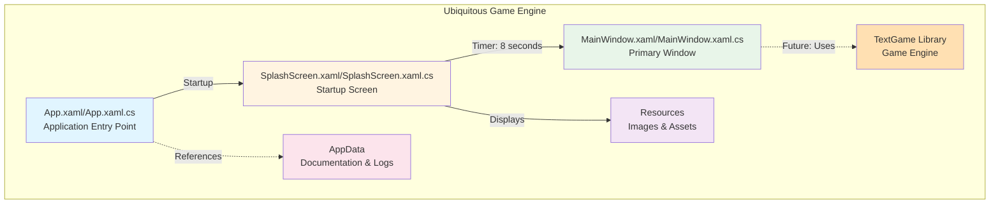

## Component Relationships

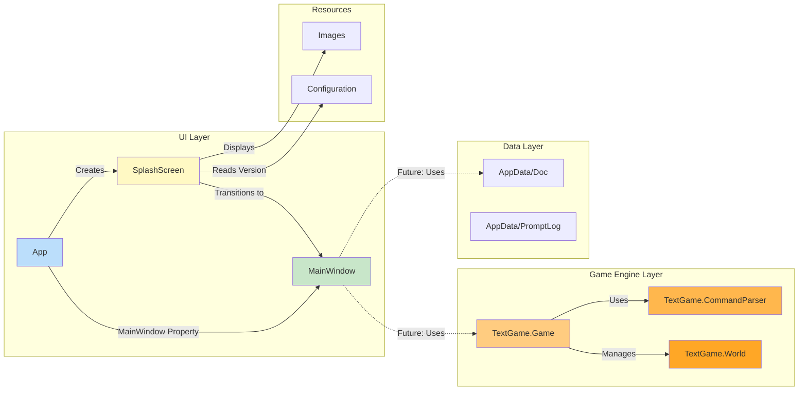

## Startup Flow

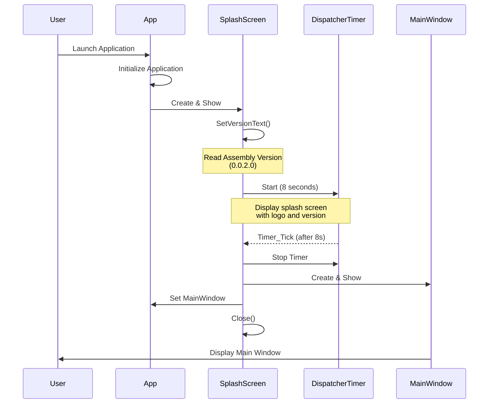

## Project Structure

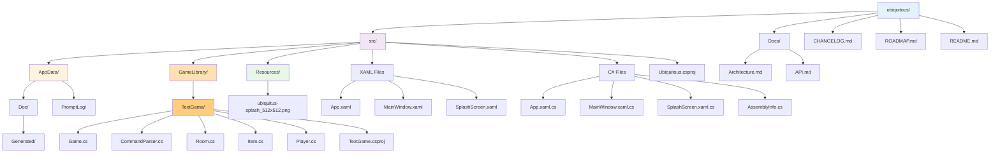

## Class Hierarchy

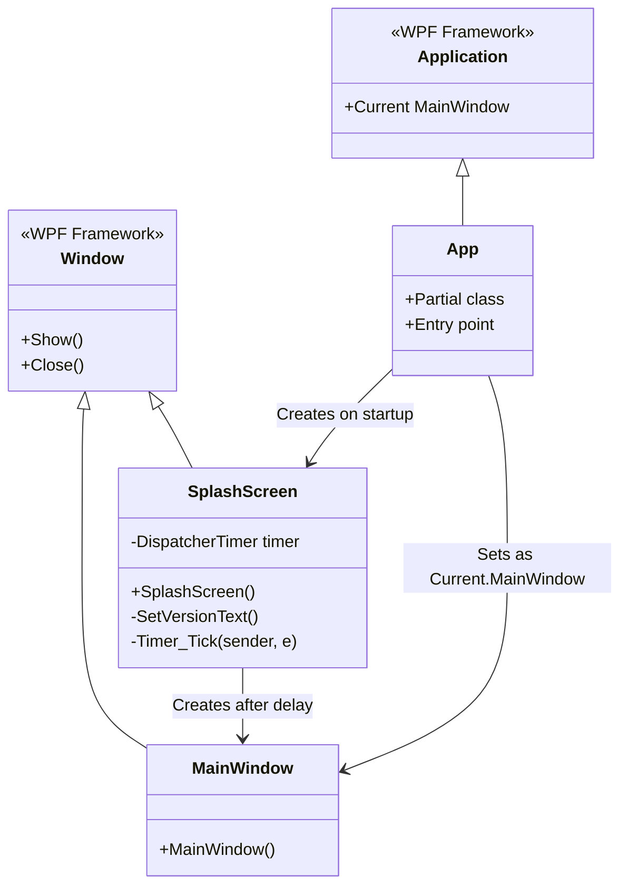

## TextGame Library Architecture

### TextGame Component Diagram

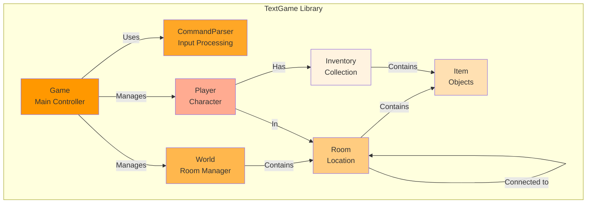

### TextGame Class Hierarchy

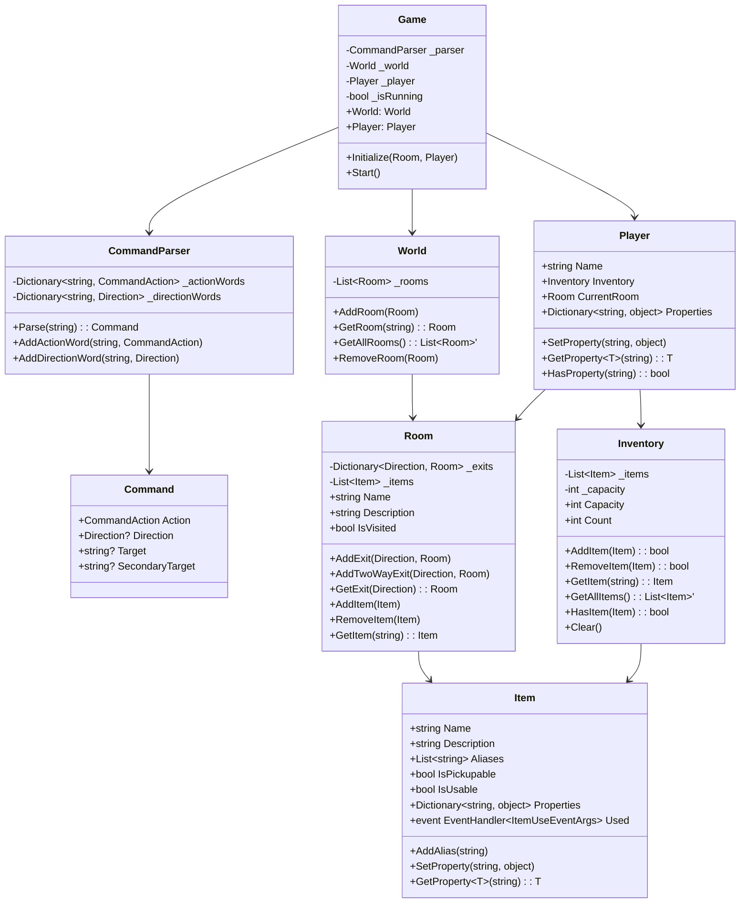

### Game Flow Diagram

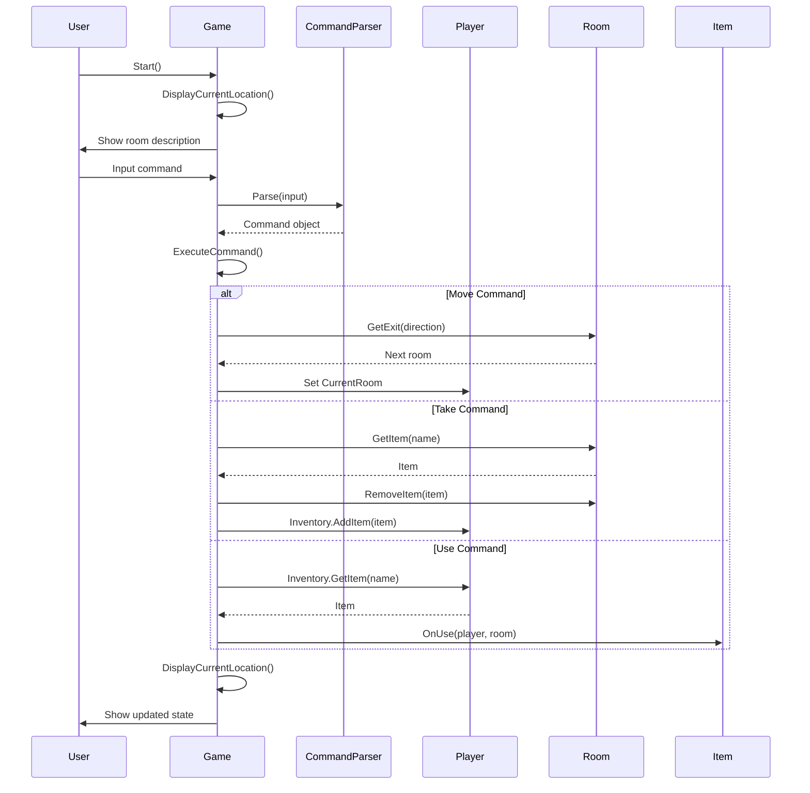

## Component Details

### App Component
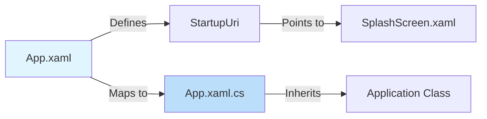

### SplashScreen Component
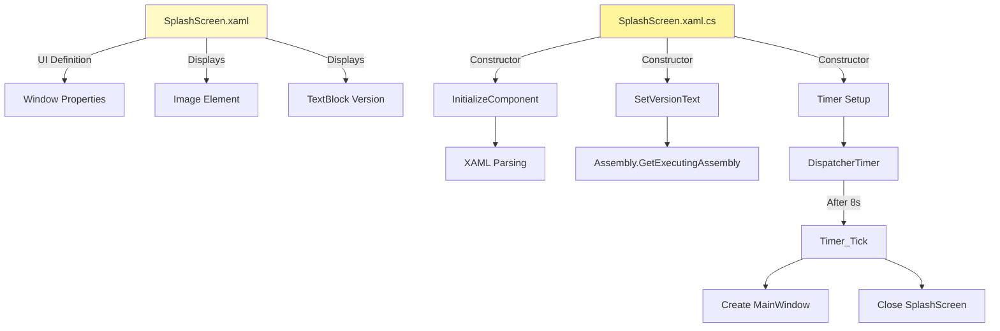

### MainWindow Component
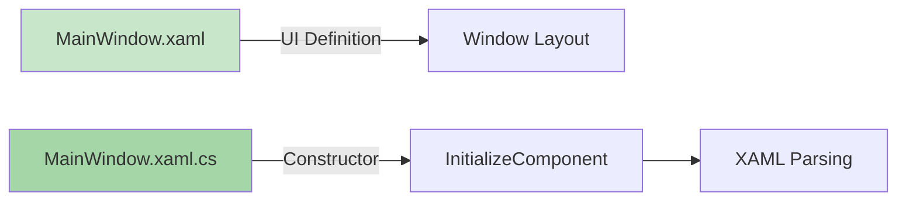

## Technology Stack

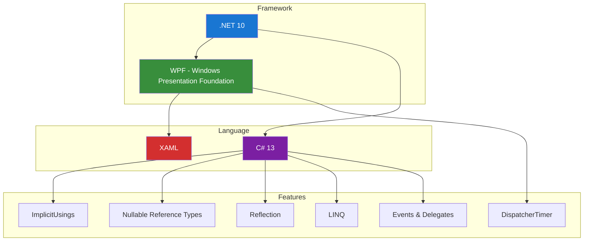

## Design Patterns

### Current Implementation

1. **Code-Behind Pattern**: Each XAML view has a corresponding code-behind file for UI logic
2. **Separation of Concerns**: Clear separation between UI (XAML) and logic (C#)
3. **Timer-Based Transitions**: Using DispatcherTimer for automatic screen transitions
4. **Resource Management**: Embedded resources for images and assets
5. **Version Management**: Centralized version information in project files
6. **Command Pattern**: TextGame uses command pattern for parsing and executing player actions
7. **Repository Pattern**: World class acts as a repository for Room objects
8. **Observer Pattern**: Item.Used event allows for flexible item behavior
9. **Dictionary-Based Lookup**: Fast command and direction resolution

### Future Considerations

The architecture is designed to support:
- MVVM (Model-View-ViewModel) pattern implementation
- Dependency injection for better testability
- Service layer for game engine functionality
- Event aggregation for loose coupling
- Repository pattern for data access

## Data Flow

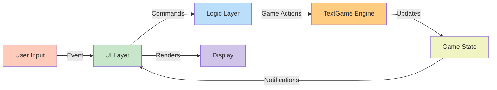

## Build and Deployment

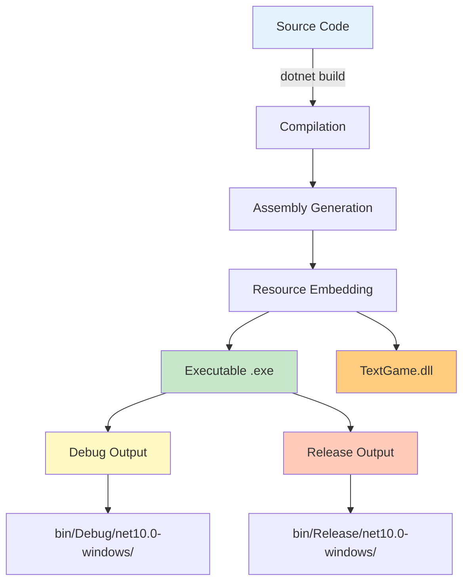

## Version Information Flow

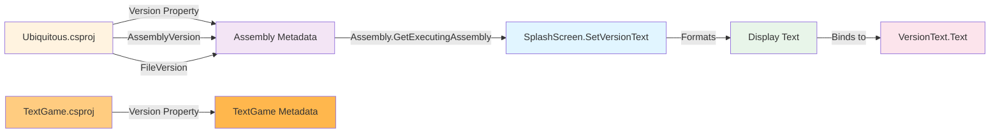

## Future Architecture Extensions

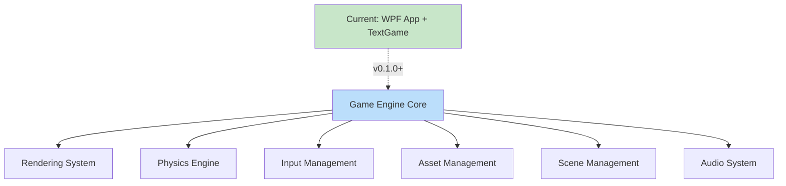

---

**Version:** 0.0.2  
**Last Updated:** December 20, 2025  
**Status:** Active Development
