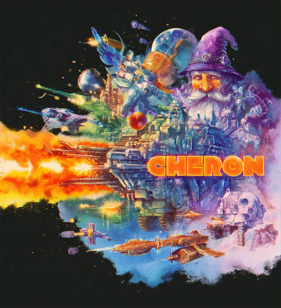

<!--
  260619_code
  260619_documentation
-->

  <picture>
    <source media="(prefers-color-scheme: dark)" srcset=".github/repository/logo/CheronLogo-Trans-512x512.png">
    <source media="(prefers-color-scheme: light)" srcset=".github/repository/logo/CheronLogo-Trans-512x512.png">
    
  </picture>

<table>
  <tr>
    <td> &nbsp;&nbsp;&nbsp;&nbsp;&nbsp;&nbsp;
  </tr>
  <!--
  <tr>
    <td> &nbsp;&nbsp;&nbsp;&nbsp;&nbsp;&nbsp;
  -->
  </tr>
</table>

---

<h6 align="center">

  [MANUALS](docs/man/README.md)&nbsp;&bull;&nbsp;[CHANGELOG](docs/CHANGELOG.md)&nbsp;&bull;&nbsp;[ROADMAP](docs/ROADMAP.md)&nbsp;&bull;&nbsp;[KNOWN ISSUES](docs/KNOWN-ISSUES.md)
  
</h6>

---

| CONTENTS                                    |
|---------------------------------------------|
| [About Cheron](#about-cheron) |
| [How it works](#how-it-works)               |
| [Getting started](#getting-started)         |
| [Installing](#installing)                   |
| [Usage](#usage)                             |
| [Acknowledgements](#acknowledgements)       |
| [Related projects](#related-projects)       |
| [License](#license)                         |

---

## About Cheron

Charon is a collection of game engines.

## The engines

### Tekst

An interactive text-based game engine that allows developers to create and manage text-based games efficiently. It provides tools and frameworks for handling game logic, player interactions, and narrative elements in a text-based format.

#### Features

* Feature — What it does and why it matters.
* Feature — What it does and why it matters.
* Feature — What it does and why it matters.

## How it works

A blurb describing how the project works at a high level.

## Getting started

A quick overview of how to get started with the project.

### Before you begin

Any assumptions, or other information a user should know before

### Requirements

| Requirement | Minimum version | Notes |
|-------------|-----------------|-------|
| Requirement |                 |       |
| Requirement |                 |       |
| Requirement |                 |       |

## Installing

Quick summary of installation instructions, or link to the Installing documentation.

## Usage

Step-by-step instructions for using the project on supported platforms.

## Documentation

Documentation is available.

## Acknowledgements

None.

## Built with

* [Technology or framework](URL)  - Role it plays in the project.
* [Technology or framework](URL)  - Role it plays in the project.
* [Technology or framework](URL)  - Role it plays in the project.

## Related projects

None.

## License

Distributed under the [Apache 2.0 License](LICENSE).  
Copyright &copy; 2026 [A Pretty Cool Program](https://github.com/APrettyCoolProgram)

<h6 align="center">

  [FAQ](docs/FAQ.md)&nbsp;&bull;&nbsp;[DEVELOPMENT](docs/DEVELOPMENT.md)&nbsp;&bull;&nbsp;[API](docs/api/README.md)&nbsp;&bull;&nbsp;[TESTING](docs/TESTING.md)&nbsp;&bull;&nbsp;[SUPPORT](docs/SUPPORT.md)&nbsp;&bull;&nbsp;[NOTICES](docs/NOTICES.md)

</h6>

<!-- ===================================================== [HORIZONTAL MENU] -->

---

Last updated: 260619

-->